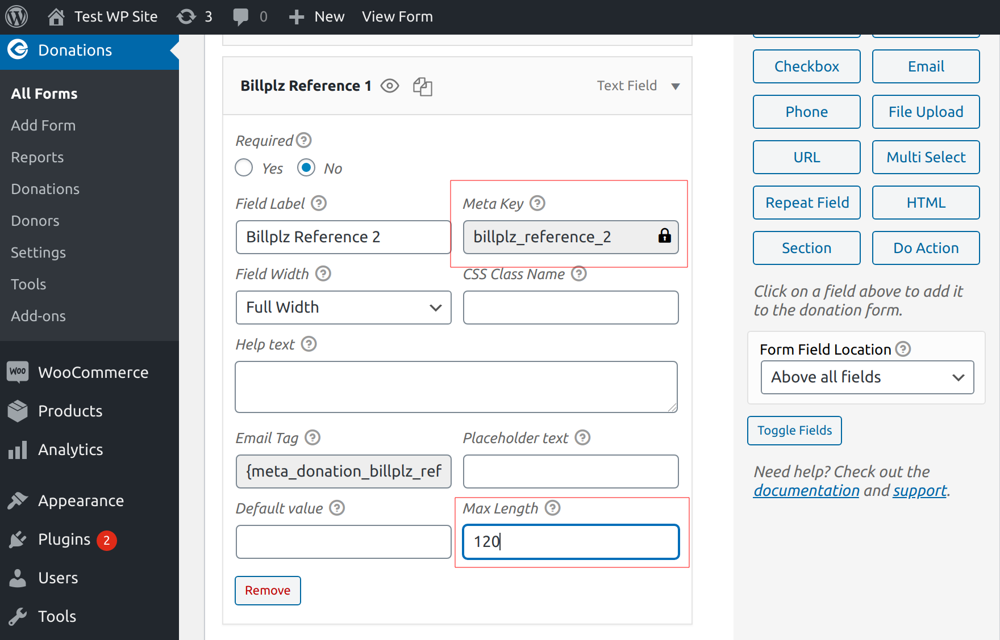

# Custom Reference for BGWP

Dynamically pass reference value based on user input

## Important Meta Key

- `billplz_reference_1` for Reference 1 value.
- `billplz_reference_2` for Reference 2 value.
- `billplz_reference_1_label` for Reference 1 Label value.
- `billplz_reference_2_label` for Reference 2 Label value.
